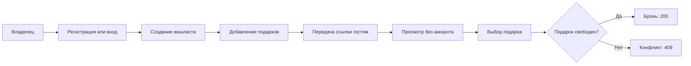
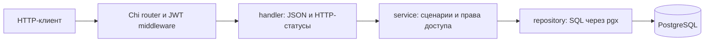
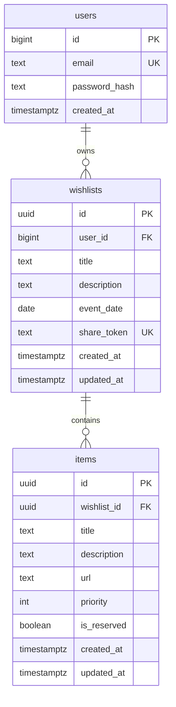

# Wishlist API

Backend-сервис для списков подарков к праздникам и событиям. Владелец регистрируется, создаёт вишлист, добавляет подарки и делится ссылкой. Гости открывают список без аккаунта и бронируют подарки, чтобы не купить одно и то же.

В репозитории находятся Go API, PostgreSQL, миграции Goose, [OpenAPI-контракт](openapi.yml), Docker Compose и тесты. Пользовательский интерфейс не входит в проект.

## Что реализовано

- регистрация и вход с JWT;
- создание, просмотр, полное и частичное изменение, удаление своих вишлистов;
- управление подарками: название, описание, ссылка и приоритет от 1 до 5;
- публичный просмотр по случайному `share_token`;
- бронирование подарка без регистрации: из конкурирующих запросов выигрывает один;
- проверка владельца и принадлежности подарка указанному вишлисту;
- атомарные частичные обновления, сохраняющие параллельные изменения других полей;
- автоматическое применение миграций и корректное завершение HTTP-сервера;
- сквозные тесты через настоящий HTTP API и PostgreSQL.

## Основные сценарии



Владелец видит только свои списки в `GET /wishlists`. Обращение к существующему чужому вишлисту возвращает `403`, к отсутствующему — `404`. Подарок из другого списка недоступен через подставленный идентификатор: такой запрос возвращает `404`.

## Основные вопросы и решения

| Вопрос | Решение |
|---|---|
| Как разрешить просмотр без регистрации? | При создании списка генерируются 16 случайных байт, представленные строкой из 32 hex-символов. `share_token` служит ключом публичного доступа. |
| Как защитить аккаунт? | В БД хранится bcrypt-хеш пароля; закрытые методы требуют JWT с подписью HS256 и сроком действия. |
| Что произойдёт при одновременной регистрации одного email? | Уникальное ограничение БД защищает от дублей; проигравший запрос получает `409`. Email приводится к нижнему регистру. |
| Как избежать двойной брони? | Условный SQL `UPDATE ... WHERE is_reserved = FALSE`: одна успешная бронь, остальные получают `409`. |
| Что делать с параллельными PATCH? | Обновлять только переданные поля непосредственно в SQL. Изменение названия не перезаписывает одновременно изменённое описание. Для одного поля действует последнее применённое обновление. |
| Где проверять данные? | Go проверяет входные значения и доступ; PostgreSQL защищает связи, уникальность и диапазон приоритета. |
| Что происходит при удалении списка? | Его подарки удаляются каскадно. Публичная ссылка перестаёт работать. |
| Кто видит бронь? | И владелец, и гости видят `is_reserved`; личность бронирующего не хранится. |

## Архитектура



Сервисы зависят от интерфейсов репозиториев, объявленных на стороне потребителя. Это позволяет проверять бизнес-сценарии без базы. Сборка зависимостей и lifecycle сервера находятся в `cmd/api`, модели и общие ошибки — в `internal/domain`.

| Каталог | Назначение |
|---|---|
| [cmd/api](cmd/api) | точка входа, конфигурация зависимостей, запуск и остановка |
| [internal/handler](internal/handler) | маршруты, разбор JSON, валидация и ответы |
| [internal/service](internal/service) | авторизация владельца, сценарии вишлистов и бронирования |
| [internal/repository](internal/repository) | запросы к PostgreSQL |
| [internal/domain](internal/domain) | сущности, входные модели и ошибки |
| [internal/jwt](internal/jwt), [internal/middleware](internal/middleware) | выпуск и проверка токенов, HTTP-авторизация |
| [internal/config](internal/config), [internal/db](internal/db) | настройки, подключение, миграции |
| [tests/e2e](tests/e2e) | сценарии через запущенное приложение |

OpenAPI описывает HTTP-контракт; обработчики написаны вручную, код из спецификации не генерируется.

## Схема БД



[Миграции](migrations) создают три таблицы, уникальные ограничения email и публичного токена, индексы по внешним ключам и `CHECK` для приоритета. Внешние ключи используют `ON DELETE CASCADE`. Для каждой миграции предусмотрен обратный шаг `Down`.

## Запуск через Docker Compose

Нужны Docker и Compose v2. Запуск из корня репозитория без предварительной настройки:

```bash
docker compose up --build -d --wait
curl -fsS http://localhost:8080/health
```

API доступен на `http://localhost:8080`, PostgreSQL — на `127.0.0.1:5432`. Миграции применяются автоматически. База изначально пустая: аккаунт и списки создаются через API. При первом запуске контейнер генерирует случайный секрет JWT и сохраняет его в отдельном volume `jwt_state`. Он сохраняется при пересоздании контейнера. Можно переопределить секрет переменной `JWT_SECRET` через окружение или `.env`. Команда из задания `docker-compose up --build` также запускает проект без дополнительных шагов.

Команды управления:

```bash
docker compose logs -f app
docker compose down
```

Данные сохраняются в именованном volume после `down`. Для полного сброса **данных и секрета JWT этого Compose-проекта** используется `docker compose down -v`; старые токены после такого сброса недействительны. Для настройки скопируйте `.env.example` в `.env`. При занятом порте задайте `PORT=18080` и/или `DB_PORT=15432` в `.env`. Если Compose установлен отдельной командой, замените `docker compose` на `docker-compose`.

## Локальный запуск Go

Нужны Go 1.25 или новее и OpenSSL. Для первого локального запуска создайте `.env`, сгенерируйте секрет и запустите PostgreSQL:

```bash
cp .env.example .env
printf '\nJWT_SECRET=%s\n' "$(openssl rand -hex 32)" >> .env
docker compose up -d --wait db
set -a
. ./.env
set +a
go run ./cmd/api
```

Приложение самостоятельно не читает `.env`; при локальном запуске переменные нужно экспортировать. `DATABASE_URL` в примере настроен на PostgreSQL на хосте. Если изменили `DB_PORT`, измените порт и в `DATABASE_URL`. Внутри Compose приложение использует адрес `db:5432` независимо от порта хоста.

## Конфигурация

| Переменная | Значение по умолчанию | Назначение |
|---|---|---|
| `PORT` | `8080` | порт Go-сервера; в Compose — опубликованный порт хоста, внутри контейнера всегда 8080 |
| `DATABASE_URL` | обязательна для Go | строка подключения; Compose задаёт её для своей БД |
| `JWT_SECRET` | обязательна для Go | секрет подписи JWT; в Docker при пустом значении генерируется и сохраняется в volume |
| `JWT_EXPIRY_MINUTES` | `60` | положительное число минут жизни JWT |
| `MIGRATIONS_DIR` | `./migrations` | каталог SQL-миграций относительно рабочей директории Go-процесса |
| `DB_PORT` | `5432` | только Compose: порт PostgreSQL на хосте |

`GET /health` проверяет, что HTTP-сервер отвечает; это liveness-проверка, она не выполняет запрос к БД. Тело JSON-запроса ограничено 1 MiB. При остановке сервер даёт активным запросам до 10 секунд на завершение.

## API

Все бизнес-методы начинаются с `/api/v1`. Полное описание запросов и ответов — в [openapi.yml](openapi.yml).

| Методы | Назначение | Доступ |
|---|---|---|
| `POST /auth/register`, `POST /auth/login` | получить JWT | без токена |
| `GET /wishlists`, `POST /wishlists` | свои списки, создание | JWT |
| `GET`, `PUT`, `PATCH`, `DELETE /wishlists/{id}` | просмотр и управление списком | владелец |
| `POST /wishlists/{id}/items` | добавить подарок | владелец |
| `PUT`, `PATCH`, `DELETE /wishlists/{id}/items/{itemId}` | изменить или удалить подарок | владелец |
| `GET /shared/{token}` | публичный список | ссылка с share token |
| `POST /shared/{token}/items/{itemId}/reserve` | забронировать подарок | ссылка с share token |

`PUT` заменяет редактируемые поля целиком, `PATCH` меняет только переданные. Пустой `{}` в PATCH — успешная операция без изменения данных. `event_date` передаётся и возвращается как `YYYY-MM-DD`; технические timestamps — в RFC3339. Приоритет по умолчанию — 3; допустимые значения — 1–5. Пустые списки возвращаются как `[]`.

Ошибки имеют вид `{"error":"..."}`: `401` — нет действительного JWT, `403` — чужой список, `404` — ресурс отсутствует, `409` — email занят или подарок уже забронирован, `422` — некорректный запрос. Внутренние ошибки возвращают `500` без деталей БД.

### Пример полного сценария

Нужны `curl` и `jq`. Используйте новый email при повторном запуске:

```bash
BASE=http://localhost:8080/api/v1
TOKEN=$(curl -fsS "$BASE/auth/register" \
  -H 'Content-Type: application/json' \
  -d '{"email":"owner@example.com","password":"secret123"}' | jq -er '.token')

WISHLIST=$(curl -fsS "$BASE/wishlists" \
  -H "Authorization: Bearer $TOKEN" \
  -H 'Content-Type: application/json' \
  -d '{"title":"День рождения","description":"Идеи подарков","event_date":"2027-06-15"}')
ID=$(printf '%s' "$WISHLIST" | jq -er '.id')
SHARE_TOKEN=$(printf '%s' "$WISHLIST" | jq -er '.share_token')

ITEM_ID=$(curl -fsS "$BASE/wishlists/$ID/items" \
  -H "Authorization: Bearer $TOKEN" \
  -H 'Content-Type: application/json' \
  -d '{"title":"Клавиатура","url":"https://example.com/keyboard","priority":5}' | jq -er '.id')

# Гостю JWT не нужен.
curl -fsS "$BASE/shared/$SHARE_TOKEN"
curl -fsS -X POST "$BASE/shared/$SHARE_TOKEN/items/$ITEM_ID/reserve"

# Повторная бронь вернёт 409.
curl -i -X POST "$BASE/shared/$SHARE_TOKEN/items/$ITEM_ID/reserve"
```

## Проверки

```bash
make test
make test-race
make lint
make test-e2e
```

Для `make lint` нужен GolangCI-Lint v2, собранный с поддержкой используемой версии Go. `make test-e2e` требует Docker, Compose v2 и Go. Команда поднимает отдельный Compose-проект со случайными портами и автоматически созданным секретом, проверяет сохранение секрета при пересоздании контейнера, запускает тесты с race detector, затем удаляет только свои контейнеры и volume. Пользовательский `.env` для этого сценария не загружается.

Перед HTTP-сценариями команда также запускает интеграционные тесты репозиториев: реальные SQL-операции, конкурентные изменения и классификацию ошибок. Эти тесты создают и удаляют только собственную случайную схему в тестовой БД; отдельно запускаются с `WISHLIST_TEST_DATABASE_URL`. Без этой переменной они пропускаются.

E2E проверяет регистрацию и вход, запрет доступа к чужим данным, пустые списки и формат даты, валидацию, конкурентные PATCH, единственного победителя бронирования, сохранение брони после редактирования и удаление подарка. Без `WISHLIST_E2E_URL` эти тесты пропускаются при обычном `go test ./...`.

Для отдельной установки Compose:

```bash
make test-e2e COMPOSE=docker-compose
```

## Упрощения MVP

- Публичная ссылка позволяет и смотреть список, и бронировать. Срока действия, перевыпуска токена и отдельных прав для гостей нет.
- Бронь хранится как флаг: нет имени гостя, снятия брони и срока её действия. Владелец видит, какие подарки заняты.
- JWT не отзываются по отдельности; refresh tokens, восстановление пароля и подтверждение email не реализованы.
- Нет пагинации, квот и ограничения частоты запросов. Списки предполагаются небольшими.
- Просмотр списка и его подарков выполняется отдельными запросами к БД: единый snapshot для конкурентного редактирования не гарантируется.
- Нет UI, уведомлений, загрузки изображений, оплаты и интеграции с магазинами.
- Compose рассчитан на локальную разработку: порты привязаны к loopback, пароль PostgreSQL демонстрационный, TLS не настроен.

## Стек

Go 1.25+, Chi, pgx v5, PostgreSQL 17, Goose, bcrypt, JWT HS256, OpenAPI 3.0, Docker Compose, GolangCI-Lint v2.
